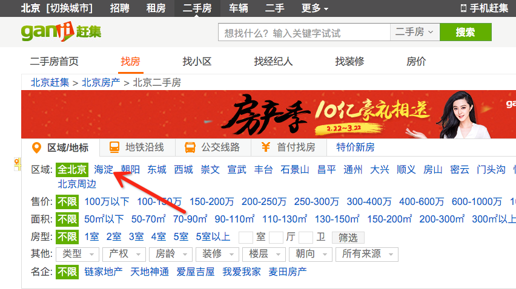
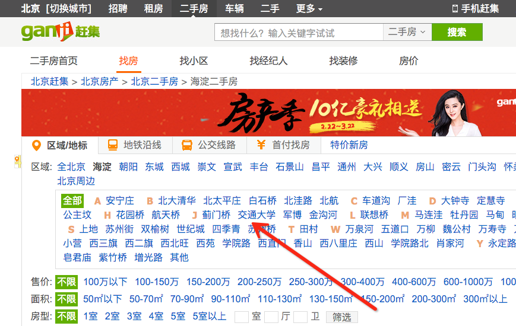
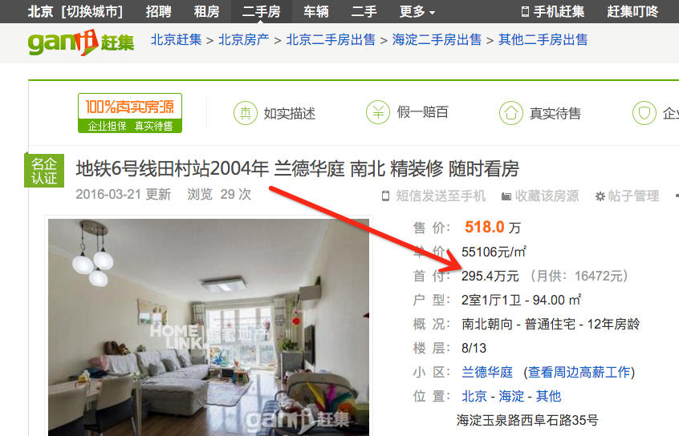
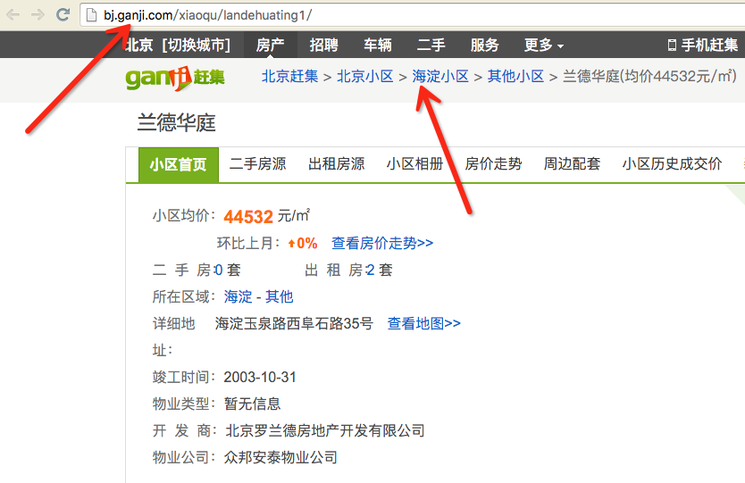
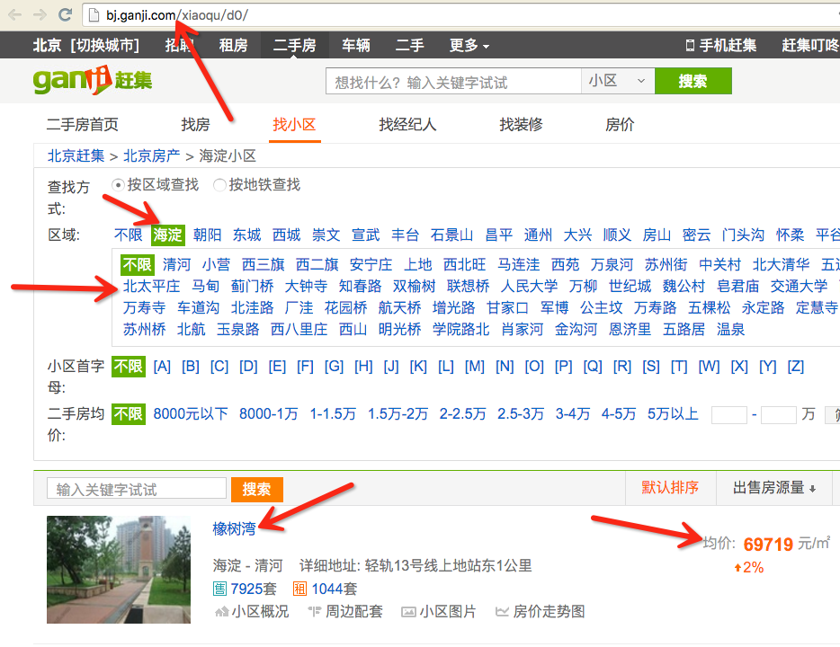
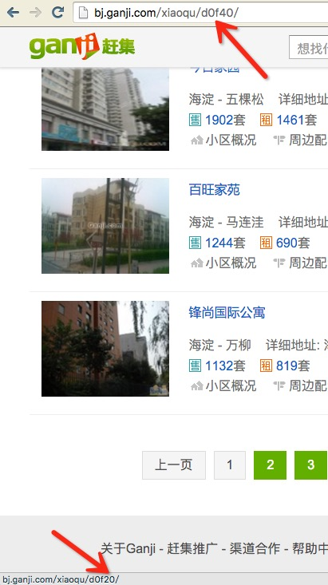
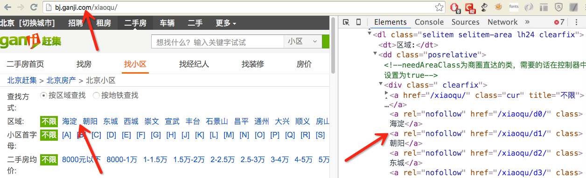

# Python爬取房屋租售信息
第一次接触“租售比”这个概念是在知乎 [团支书](http://www.zhihu.com/people/metrodatateam) 对 [如何通过房屋租售比来判断房产的价值或泡沫？](http://www.zhihu.com/question/20799544) 这个问题的回答上看到的，当时看到她搞出来的一些图和分析就感觉很有意思，寻思着自己也可以尝试用相同的方法对北京的房屋租售信息做一个分析。没想到一搜索，类似的东西早就有人做出来了。比如在知乎上的这个问题：[北京在哪里租房的居住性价比高？](http://www.zhihu.com/question/36973380)。高票答案虽然来自链家旗下自如的员工，但是其以热力图一目了然的展示出了北京出租房房租的高低分布情况，难怪下面会有知友回复说：广告满分。然后还有这篇文章[【租房数据分析】2016年在北京如何租到好房子?](http://www.36dsj.com/archives/41273)，再加上今年这刚一开始，北京、上海的房价又开始一轮疯涨，自然就更让大家开始关注房产有关的信息。于是，个人也尝试着把这个事情搞一搞。

## 处理流程
首先来看处理流程，其实就是一个数据收集、处理、分析和展示的过程。

对于数据收集，58同城、赶集网、链家网这些上面有着丰富的信息，只不过对于前面两个网站，现在，哦，可能一直都是这样，已经差不多都被中介信息给淹没了。所以即使这些网站已经提供了大量的信息，但是如果真的想拿来使用，还是要进行一些处理。

对于数据分析，相信每个人都有自己独特的视角，同样一份数据，不同的人有着不同的关注点，所以很难制定统一的规则，这里就单从价格这一方面来做一个统计。

对于数据展示，因为要看的是一个城市的数据，因此热力图是一个很好的选择，而百度地图已经提供了很方便的接口，所以这里使用百度的地图接口来进行热力图的展示。

由此，处理流程大致分为一下几个步骤：

1. 选定某个城市
2. 抓取区域信息
3. 制定翻页规则
4. 抓取租售信息
5. 获取位置信息
6. 生成价格热图

## 详细流程

这里以赶集网的二手房销售信息为例，演示如何抓取数据并将结果展示到热力图上。

### 页面分析
首先打开 [赶集网北京站](http://bj.ganji.com)，可以看到，排在左上角的就是"北京房产", 由这个位置就可以想见，房地产相关的业务得占了它全站多大的比例。


我们直接点击 [二手房](http://bj.ganji.com/fang5/) 来看一下这个页面，发现上面给出了北京市的几个区域，方便用户在特定城区查找房源。



如果你看过知乎上的这个问答：[如何不吹牛地形容北京有多大？](http://www.zhihu.com/question/29554848)，那么你一定会理解对于帝都来说，只给出一个城区那范围有点太大了。所幸，这些网站都在某个区域下给出了更详细分区。



页面的下半部分，是各大中介发布的出售信息，先别为令人咋舌的房价感慨，随便点开一条信息，进入到详细页面，可以看到里面把总价、单价、户型、楼层、小区、位置等都描述的非常清楚了，有点甚至连首付和月供都已经帮你算好了。这么丰富的信息，基本上已经满足了从多个维度对房产信息进行分析统计。



但是作为演示，暂时没有必要搞那么复杂，这里只需要统计一下每个小区的均价，给出按照小区价格的热力图就可以了。

在详细页面里给出了该条出售信息的房源所属的小区，点击进入小区的详细页面，可以看到小区有着这样一个结构。



点击上一级页面，我们看到有关小区的列表页，而且这里已经给出了某个小区的均价。



由此我们可以制定我们的抓取策略。首先我们抓取某个城市的区域信息，然后抓取某个区域下面的子区域信息，最后再抓取某个子区域下的小区信息。

这里还有一个问题需要注意，某个区域下的小区列表可能不仅仅只有一页，所以还要处理翻页。



由图即可看到翻页的规律。

### 数据抓取

这里使用最简单的方式-基于 **urllib2** 进行页面抓取

``` python

import urllib2
response = urllib2.urlopen('http://bj.ganji.com/xiaoqu')
html = response.read()
with open('index.html', 'w') as html_file:
	html_file.write(html)
```

打开抓取的页面，使用**Chrome**的**开发者工具**对**HTML**进行分析



由此即可根据 [XPath](http://www.w3school.com.cn/xpath/) 确定城市下面的区域选择器为

``` python
area_select = '//dl[@class="selitem selitem-area lh24 clearfix"]//div[@class=" clearfix"]/a[@rel="nofollow"]'
```

以[lxml](http://lxml.de/)作为解析HTML的工具，尝试获取城市的区域信息

``` python
from lxml import etree

html = file('index.html').read().decode('UTF-8')
doc = etree.HTML(html)
area_select = '//dl[@class="selitem selitem-area lh24 clearfix"]//div[@class=" clearfix"]/a[@rel="nofollow"]'
area_list = doc.xpath(area_select)
for area in area_list:
	print area.xpath('string()'), area.get('href')
```

使用相同的方式，即可实现对某个区域下子区域信息的抓取，这里以海淀区为例

``` python
import urllib2

response = urllib2.urlopen('http://bj.ganji.com/xiaoqu/d0')
html = response.read()
doc = etree.HTML(html)
subarea_select = '//dl[@class="selitem selitem-area lh24 clearfix"]//div[@class="subarea clearfix"]/a[@rel="nofollow"]'
subarea_list = doc.xpath(subarea_select)
for subarea in subarea_list:
	print subarea.xpath('string()'), subarea.get('href')
```

再来试试对某个子区域下小区信息的抓取，这里以宇宙中心-五道口为例

``` python
import urllib2

response = urllib2.urlopen('http://bj.ganji.com/xiaoqu/d0s11')
html = response.read()
doc = etree.HTML(html)
community_select = '//div[@class="listBox"]/ul/li]'
community_list = doc.xpath(community_select)
for community in community_list:
	name = community.xpath('./div[@class="list-mod2"]/div[@class="info-title"]/a')[0].xpath('string()')
	price = community.xpath('./div[@class="list-mod3 xq-price clearfix"]/p/b')[0].xpath('string()')
	print name, price
```

### 数据展示

数据有了，接下来就是如何展示。

首先查看一下百度地图的[JavaScript API](http://lbsyun.baidu.com/index.php?title=jspopular)，里面提到
>该套API免费对外开放。自v1.5版本起，您需先申请密钥（ak）才可使用，接口（除发送短信功能外）无使用次数限制。

所以，注册一个帐号，然后申请密钥即可。

文档里已经给出了一个[热力图示例](http://developer.baidu.com/map/jsdemo.htm#c1_15)，通过源码可以看到关键在于定义点坐标。

``` javascript
var points =[
    {"lng":116.418261,"lat":39.921984,"count":50},
    {"lng":116.423332,"lat":39.916532,"count":51},
    {"lng":116.419787,"lat":39.930658,"count":15},
    ...]
```

好在百度开放平台提供了[Geocoding API](http://lbsyun.baidu.com/index.php?title=webapi/guide/webservice-geocoding)
>Geocoding API 是一类简单的HTTP接口，用于提供从地址到经纬度坐标或者从经纬度坐标到地址的转换服务，用户可以使用C# 、C++、Java等开发语言发送HTTP请求且接收JSON、XML的返回数据。

测试一下

``` python
import urllib2

ak = '密钥'
city = '北京市'
address = '华清嘉园'
api_url = 'http://api.map.baidu.com/geocoder/v2/?ak=%s&output=json&city=%s&address=%s' % (ak, city, address)
result = urllib2.urlopen(api_url).read()
print result
```

返回结果格式如下

``` javascript
{"status": 0,
 "result": {
     "location": {
         "lng": 116.34213332629,
         "lat": 39.997261285991
     },
     "precise": 0,
     "confidence": 60,
     "level": "地产小区"
 }}
```

有了它就可以批量完成已抓取小区的坐标转换了。

``` python
import urllib2
import json

def get_coordinate(address, ak='密钥', city='北京市'):
    api_url = 'http://api.map.baidu.com/geocoder/v2/?ak=%s&output=json&city=%s&address=%s' % (ak, city, address)
    result = urllib2.urlopen(api_url).read()
    return json.loads(result)

def transform(community_data):
    points = []
    for name, price in community_data.iteritems():
        obj = get_coordinate(name)
        if obj['status'] != 0:
            continue
        d = obj['result']['location']
        d['price'] = float(price)
        points.append(d)
    with open('data/heatmap_data.js', 'w') as jsfile:
        jsfile.write('var points = ' + json.dumps(points) + ';')
```

数据有了，现在只需要把[热力图示例](http://developer.baidu.com/map/jsdemo.htm#c1_15)中给出的页面修改一下，就可以显示抓取到的结果了。

``` html
<!-- 导入生成的js文件 -->
<script type="text/javascript" src="data/heatmap_data.js"></script>

<script type="text/javascript">
// 注销掉示例数据
// var points = [
    {"lng":116.418261,"lat":39.921984,"count":50},
    {"lng":116.423332,"lat":39.916532,"count":51},
    {"lng":116.419787,"lat":39.930658,"count":15},
    ...];
</script>
```

## 注意事项

既然是爬取别人网站上的数据，当然道德也很重要，我们来看一下[赶集网Robots规则](http://www.ganji.com/robots.txt)

```
User-agent: *
Disallow: /tel/*.png
Disallow: /*/?navtab=
Disallow: /404.html
Disallow: /findjob/send_resume.php
Disallow: /user/
Disallow: /misc/
Disallow: /zq_biyeji/
Disallow: /utils/
Disallow: /pub/
Disallow: /sorry/
```

还好我们只是抓取租售信息，这些都并不在屏蔽之列，只要不是抓的太狠(间隔时间过短)，还是可以基于此尝试做一些有趣的统计和分析的。


